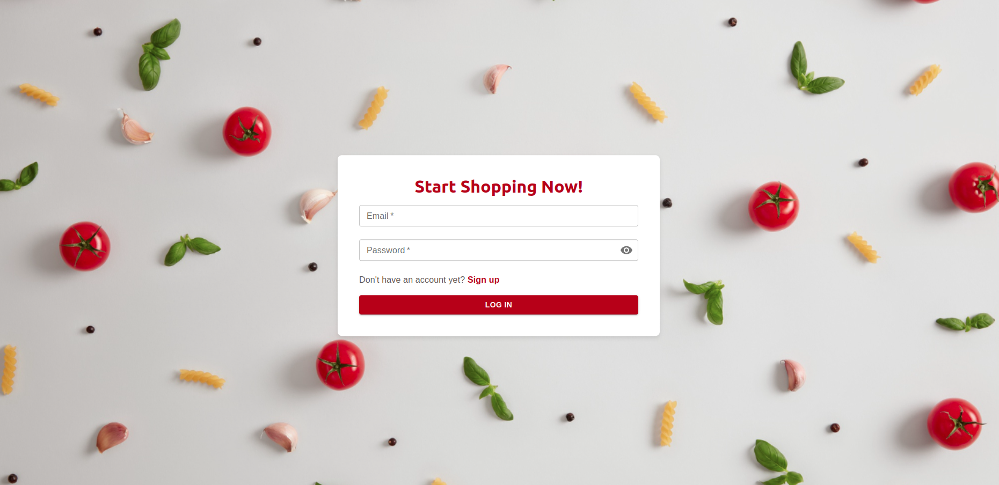
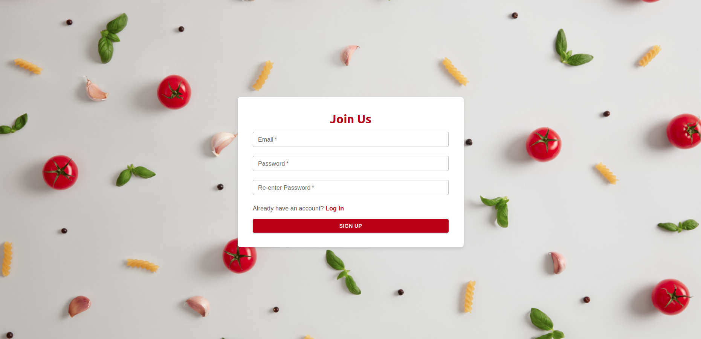
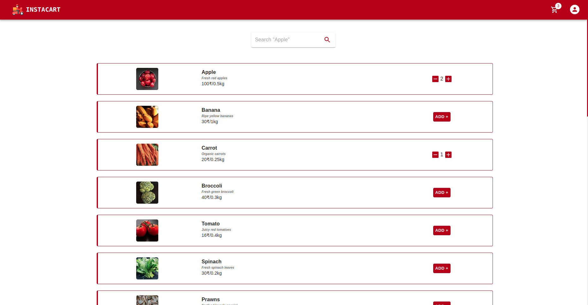
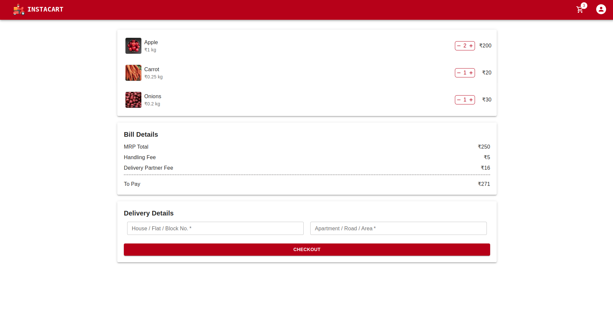

# Grocery Delivery App

## Description

This is a grocery delivery app that allows users to browse products, add them to their cart, and place orders. It includes user authentication with login and signup functionalities, as well as features to add or remove items from the cart and place orders.

## Features

- **User Authentication:** Secure login and signup for users.
- **Product Browsing:** View a list of available grocery items.
- **Shopping Cart:** Add items to the cart, view cart contents, and remove items.
- **Order Placement:** Complete the purchase and place orders.

## Technologies Used

- **Frontend:** React.js, Material-UI
- **State Management:** Redux Toolkit
- **Backend:** Express.js
- **Database:** MongoDB

## Images

*Login Page*

*SignUp Page*

*Shop Page*

*Search Feature*

*Cart Page*